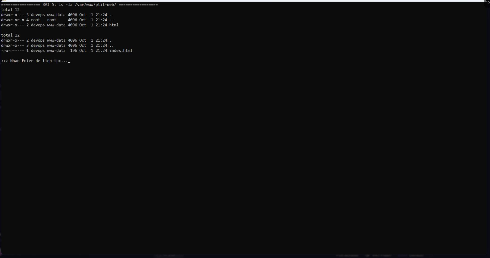
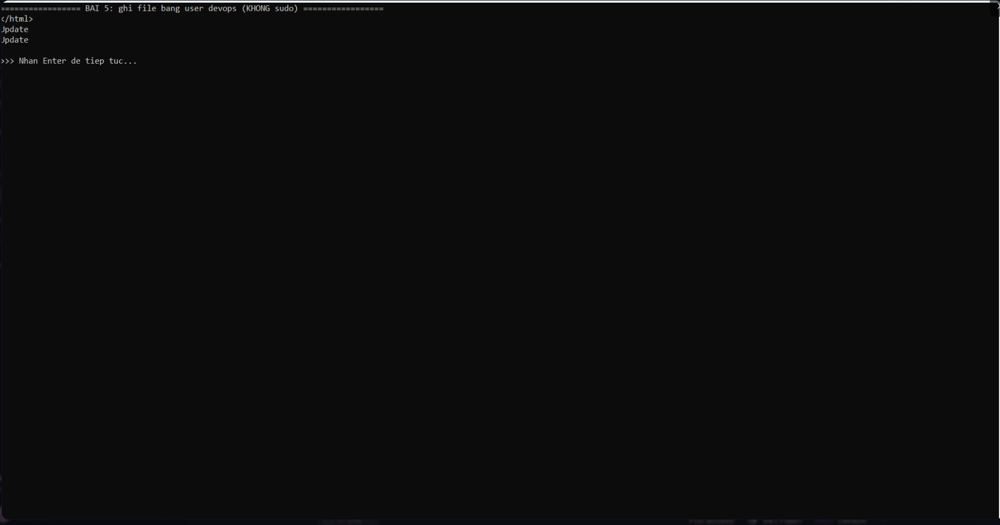
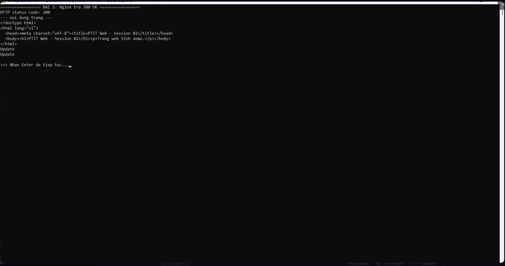

# Bài 5: Quản lý quyền sở hữu thư mục Web (Directory Permission Management)

## 1. Mục tiêu

- Hiểu cơ chế phân quyền tệp tin/thư mục trên Linux qua `chown` và `chmod`.
- Phân quyền thư mục web tĩnh `/var/www/ptit-web/` sao cho:
  - User **devops** chỉnh sửa mã nguồn trực tiếp **không cần sudo**.
  - Dịch vụ **Nginx** (chạy dưới user **www-data**) vẫn đọc và hiển thị website bình thường (không lỗi `403 Forbidden`).

## 2. Bối cảnh

Thư mục `/var/www/ptit-web/` hiện thuộc sở hữu của `root`, khiến tài khoản `devops` không thể sửa file trực tiếp. Cần chuyển quyền cho `devops` và nhóm `www-data`.

## 3. Ràng buộc phân quyền

| Đối tượng | Quyền | Ý nghĩa |
|-----------|-------|---------|
| Owner (`devops`) | `rw` (Read/Write) | Sửa mã nguồn không cần sudo |
| Group (`www-data`) | `r` (Read) + `x` trên thư mục | Nginx đọc file và truy cập thư mục |
| Others | Không truy cập | Tăng bảo mật |

Lựa chọn quyền:

- **Thư mục:** `750` (`rwxr-x---`) — cần bit `x` để đi vào/duyệt thư mục.
- **Tệp tin:** `640` (`rw-r-----`) — không cần `x`.

## 4. Thực hiện

Cài đặt Nginx và tạo user `devops` (nếu chưa có):

```bash
sudo apt update
sudo apt install -y nginx
sudo adduser devops
```

Chuyển quyền sở hữu và phân quyền:

```bash
# 1. Đổi owner -> devops, group -> www-data (đệ quy)
sudo chown -R devops:www-data /var/www/ptit-web/

# 2. Thư mục: 750, tệp tin: 640
sudo find /var/www/ptit-web/ -type d -exec chmod 750 {} \;
sudo find /var/www/ptit-web/ -type f -exec chmod 640 {} \;
```

> Có thể dùng nhanh `sudo chown -R devops:www-data /var/www/ptit-web/` và `sudo chmod -R 750 /var/www/ptit-web/`, nhưng cách tách thư mục/tệp tin ở trên chuẩn hơn (tệp tin không cần bit `x`).

Đảm bảo thư mục cha cho phép Nginx đi qua (không chặn `403`):

```bash
sudo chmod 755 /var/www
```

Khởi động lại Nginx:

```bash
sudo systemctl restart nginx
sudo systemctl status nginx --no-pager
```

## 5. Kiểm tra

### 5.1. Kiểm tra phân quyền

```bash
ls -la /var/www/ptit-web/
ls -la /var/www/ptit-web/html/
```

Kết quả thực tế (Ubuntu 26.04.1 LTS):

```
total 12
drwxr-x--- 3 devops www-data 4096 Oct  1 21:24 .
drwxr-xr-x 4 root   root     4096 Oct  1 21:24 ..
drwxr-x--- 2 devops www-data 4096 Oct  1 21:24 html

total 12
drwxr-x--- 2 devops www-data 4096 Oct  1 21:24 .
drwxr-x--- 3 devops www-data 4096 Oct  1 21:24 ..
-rw-r----- 1 devops www-data  189 Oct  1 21:24 index.html
```

Thư mục `drwxr-x---` (750) và file `-rw-r-----` (640) đúng như ràng buộc.

### 5.2. Kiểm tra ghi file bằng user devops (không dùng sudo)

```bash
su - devops
echo "Update" >> /var/www/ptit-web/html/index.html
tail -n 1 /var/www/ptit-web/html/index.html
```

Kết quả mong đợi:

```
Update
```

Ghi thành công — chứng minh `devops` có quyền `rw` trên file.

### 5.3. Kiểm tra Nginx hiển thị nội dung mới

```bash
curl -I http://localhost
curl http://localhost | tail -n 3
```

Kết quả mong đợi:

- Trả về `HTTP/1.1 200 OK` (không phải `403 Forbidden`).
- Nội dung trang chứa dòng `Update` vừa ghi.

### 5.4. Kiểm chứng phân quyền

```bash
# User khác (others) không đọc được
su - otheruser -c 'cat /var/www/ptit-web/html/index.html'   # -> Permission denied
```

## 6. Ảnh chụp màn hình







## 7. Kết luận

- Thư mục web thuộc sở hữu `devops:www-data`.
- `devops` ghi/sửa file thoải mái mà không cần `sudo`.
- Nginx (`www-data`) vẫn đọc và phục vụ web bình thường, không còn lỗi `403 Forbidden`.
- Others bị chặn truy cập, tăng tính bảo mật.
